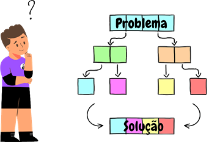

---

Se estás ansioso para começar a programar, isso é **fantástico**! A programação é um campo empolgante que permite criar, projetar e construir coisas incríveis. Porém, antes de mergulhar na codificação, há um princípio importante que tens de ter em mente: **pensar antes de teclar**.

Como **estudante** de **Ciências da Computação**, aprendi que programar é uma ferramenta poderosa que pode dar vida às nossas ideias e envolve muito mais do que apenas escrever código: requer uma compreensão profunda da matemática e habilidades de lógica e de resolução de problemas para criar soluções eficientes e eficazes.

>A palavra _“programa”_ vem do grego _“programma”_, uma derivação de _“prographein”_ = _“pro”_ (antes) + _“graphein”_ (escrever). Isto sugere que alguém que programa deve pensar antes no que vai fazer.

– [**José Nuno Oliveira**](https://www.di.uminho.pt/~jno/)

## O que significa pensar antes de teclar?

Essencialmente, significa reservar um tempo para pensar no que desejas fazer antes de começar a escrever o código. Isso pode envolver desenhar diagramas, listar ou simplesmente pensar nas etapas que precisas de seguir para resolver um problema específico.  Para isso, tens de pegar no problema e dividi-lo em partes menores e mais simples e, posteriormente, criar um plano de ação. Este processo costuma ser chamado de **"pensamento algorítmico"** e é uma habilidade fundamental que os cientistas da computação e engenheiros informáticos usam para abordar problemas complexos.

## Porque é que é importante pensar antes de escrever código?

Existem várias razões. Em primeiro lugar, programar pode ser um processo complexo e demorado. Se começares a escrever código sem um plano claro em mente, provavelmente perderás muito tempo com falsas partidas, becos sem saída e _debugging_. Ao reservar um tempo para pensar nas coisas de antemão, **economizas muito tempo** e **poupas frustração** a longo prazo.

Outro aspeto importante de pensar antes de programar é entender a matemática por trás da programação. Embora linguagens de programação como **_Python_, _Java_, _C_**… nos permitam criar programas poderosos, elas são construídas com base em conceitos matemáticos. Quando tens um plano claro em mente, é menos provável que cometas erros ou ignores detalhes importantes. Por exemplo, os algoritmos, que são uma parte fundamental do estudo desta área, são baseados em princípios matemáticos como **eficiência**, **correção** e **escalabilidade**.

Por fim, pensar antes de bater no teclado ajuda-te a ser um programador melhor, em geral. Quando reservas algum tempo para planear o teu código, és forçado a pensar mais profundamente sobre o problema que resolves. Isso pode levar a soluções mais elegantes, a uma melhor organização de código e algoritmos mais eficientes. Pensar num problema é também considerar casos extremos e possíveis erros. Considerar esses cenários antes de escrever o código ajuda-te a ter uma solução mais robusta e menos propensa a erros. Na programação, é essencial **considerar todos os resultados** possíveis e garantir que o teu código esteja preparado para lidar com eles. Desenvolver bons hábitos de planeamento desde o início preparar-te-á para o **sucesso** enquanto continuas a aprender e crescer como programador.

---
**Curiosidade**: Há uma abordagem de desenvolvimento de software chamada [Test-driven Development (TDD)](https://pt.wikipedia.org/wiki/Test-driven_development) que também destaca a importância de pensar antes de escrever código. Com o TDD, os programadores escrevem testes antes de escrever o código em si. Desta forma, o desenvolvimento é guiado pelos testes e garante que o código funcione conforme o esperado. O processo do TDD geralmente envolve os seguintes passos:

1. Escrever um teste automatizado que defina um comportamento desejado para uma funcionalidade que ainda não existe.
2. Executar o teste e verificar se ele falha (o que é esperado, já que a funcionalidade ainda não foi implementada).
3. Escrever o código mínimo necessário para fazer o teste passar.
4. Executar novamente o teste e verificar se ele agora passa.
5. Refatorar o código, se necessário, para melhorar a qualidade e a legibilidade.
6. Repetir os passos anteriores para adicionar mais funcionalidades ou corrigir erros.

Ao seguir esse ciclo de desenvolvimento, o programador garante que cada funcionalidade do código seja testada e validada, aumentando a confiabilidade e a robustez do sistema. O TDD promove uma abordagem orientada por testes, ajudando a definir requisitos claros, reduzir erros e facilitar a manutenção do código.

---

## Resumo

Então, fazendo as contas finais, as **principais ideias** são:

1. **Define o problema:** antes de começar a programar, certifica-te que entendes exatamente qual problema que estás a tentar resolver. Faz uma **descrição clara do problema**, com quaisquer restrições ou requisitos que precises de considerar.

2. **Divide:** após entender o problema, divide o problema em **partes mais pequenas e mais simples**. Pensa nas etapas que precisas de seguir para resolver cada peça e como elas se encaixam para formar a solução maior.

3. **Planeia os teus algoritmos**: se o problema envolve cálculos matemáticos ou algoritmos, reserva um tempo para planear. Escreve as etapas que precisas de seguir e certifica-te que entendes a lógica por trás de cada etapa, como um **verdadeiro matemático**.

4. **Fazer desenhos:** se ajudar, desenha diagramas ou fluxogramas para **ajudar a visualizar** a solução. Isso pode ser especialmente útil para problemas ou algoritmos complexos.

5. **Testar**: Ainda antes de passares para o computador, **confirma** que tens a solução correta! Usa a tua cabeça ou até mesmo escreve um _debugger_, por exemplo, um pseudocódigo, para garantir que esteja tudo a funcionar conforme o esperado.

6. **Escreve o código:** agora que tens um plano, é hora de escrever o código. Se seguires os passos anteriores, nada te garante que não terás problemas, mas não te preocupes, é normal. Apenas **recomeça** e tenta novamente.

Concluindo, como alguém que estuda ciências da computação, este é o caminho que ainda uso para me tornar num programador atento e eficiente, capaz de enfrentar até mesmo os problemas mais complexos com confiança. Lembra-te: pensar antes de escrever código é uma habilidade essencial para qualquer programador e **nunca é cedo demais para começar a desenvolver bons hábitos**.
